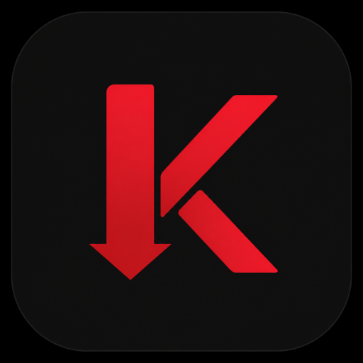
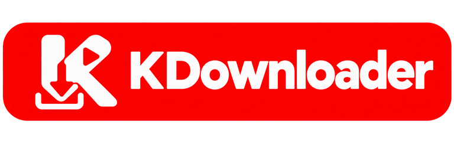

<div align="center">



# KDownloader

**A private, on-device media downloader for Android, powered by yt-dlp and FFmpeg.**

[](https://developer.android.com/about/versions/nougat)
[](https://openjdk.org/projects/jdk/17/)
[](https://github.com/yt-dlp/yt-dlp)
[](LICENSE)



</div>

## About

KDownloader turns a shared or pasted media link into a downloadable video or audio file. Extraction,
format selection, conversion, and storage happen on the Android device; the app has no KDownloader
account system, telemetry service, or media-processing backend.

The current integration targets are:

- YouTube
- TikTok
- Instagram
- Facebook

Website behavior changes frequently, so extraction depends on the bundled yt-dlp version and on the
source being publicly accessible.

## Highlights

- Fetches available qualities and presents them in a compact, scrollable format list.
- Downloads Android-compatible MP4 video with audio or converts audio-only downloads to MP3.
- Keeps active downloads running through an Android foreground service with progress notifications.
- Stores completed files in `Download/KDownloader` through MediaStore.
- Opens and shares completed media with other Android apps using scoped URI permissions.
- Keeps a searchable local history with video/audio filters and file actions.
- Accepts links pasted from the clipboard or shared from another Android app.
- Supports light, dark, and system themes without restarting the app.
- Retains only the three most recent links on the home screen.
- Includes a pinned yt-dlp binary whose SHA-256 is verified before every build.

## How it works

1. Paste a supported URL or share one to KDownloader.
2. Tap **Get formats**.
3. Select a video quality or **Audio (MP3)**.
4. Follow progress from the app or notification.
5. Open, share, or manage the completed file from History.

## Technology

| Area | Implementation |
| --- | --- |
| Language | Java 17 |
| UI | Android Views, Material 3, AppCompat, Fragments |
| Media engine | yt-dlp through `youtubedl-android` 0.18.1 |
| Processing | Bundled FFmpeg |
| Persistence | Room 2.6.1 |
| Images | Glide 4.16.0 |
| Minimum Android | API 24 (Android 7.0) |
| Target Android | API 35 |

Supported native ABIs: `armeabi-v7a`, `arm64-v8a`, and `x86_64`.

## Project layout

```text
app/src/main/java/com/kira/kdownloader/
├── data/       Room database, DAO, and history entities
├── engine/     yt-dlp setup, extraction, and format selection
├── service/    Foreground download execution and progress events
├── settings/   Preferences, secure storage, and settings UI
├── ui/         Home, History, adapters, and reusable views
└── util/       MediaStore, thumbnails, formatting, and URL helpers
```

## Build locally

### Requirements

- Android Studio with Android SDK 35
- JDK 17

Clone the repository and open it in Android Studio:

```bash
git clone https://github.com/aliomar139/KDownloader.git
cd KDownloader
```

Android Studio normally creates `local.properties` automatically. For a command-line setup, point it
to your Android SDK:

```properties
sdk.dir=/absolute/path/to/Android/sdk
```

Useful Gradle tasks:

```bash
./gradlew assembleDebug
./gradlew testDebugUnitTest
./gradlew lintDebug
./gradlew verifyBundledYtDlp
```

On Windows, use `gradlew.bat` instead of `./gradlew`.

## Permissions

| Permission | Purpose |
| --- | --- |
| `INTERNET` | Fetch metadata and download media |
| `POST_NOTIFICATIONS` | Show progress and completion notifications on Android 13+ |
| `FOREGROUND_SERVICE` | Keep downloads active when the app is backgrounded |
| `FOREGROUND_SERVICE_DATA_SYNC` | Declare download work on recent Android versions |
| `READ_MEDIA_AUDIO`, `READ_MEDIA_VIDEO` | Access completed media on Android 13+ |
| Legacy storage permissions | Support Android versions before scoped storage |

## Privacy and responsible use

KDownloader processes URLs and media on the device. It does not provide a hosted proxy, bypass
access controls, or grant rights to download third-party content. Only download content you own or
have permission to save, and follow the source website's terms and applicable law.

## Contributing

Bug reports and focused pull requests are welcome. Read [CONTRIBUTING.md](CONTRIBUTING.md) before
submitting a change.

## Acknowledgements

- [yt-dlp](https://github.com/yt-dlp/yt-dlp)
- [youtubedl-android](https://github.com/JunkFood02/youtubedl-android)
- [FFmpeg](https://ffmpeg.org)

## License

KDownloader is available under the [MIT License](LICENSE).
